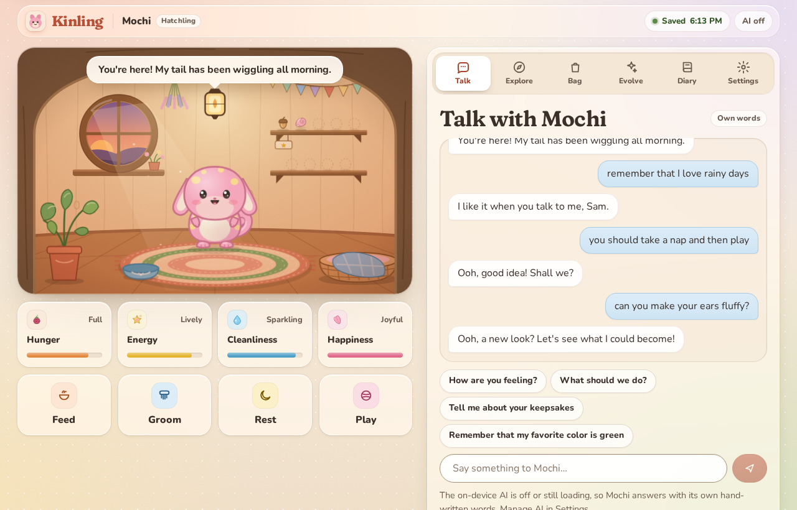
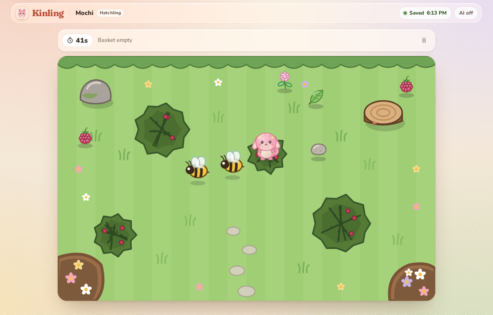
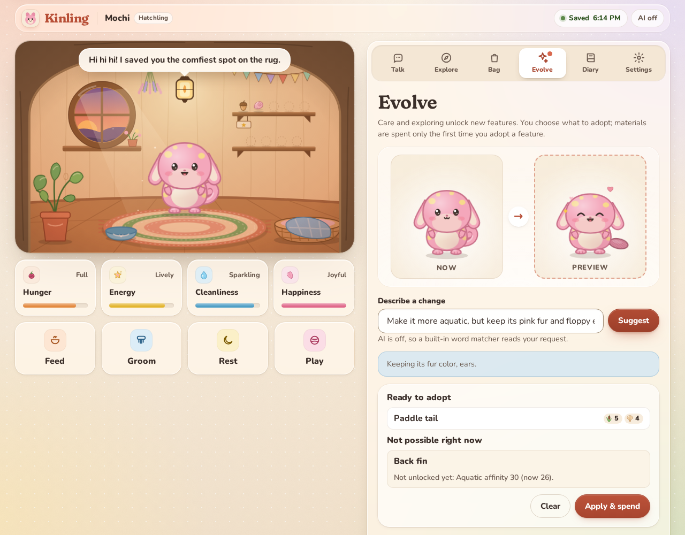
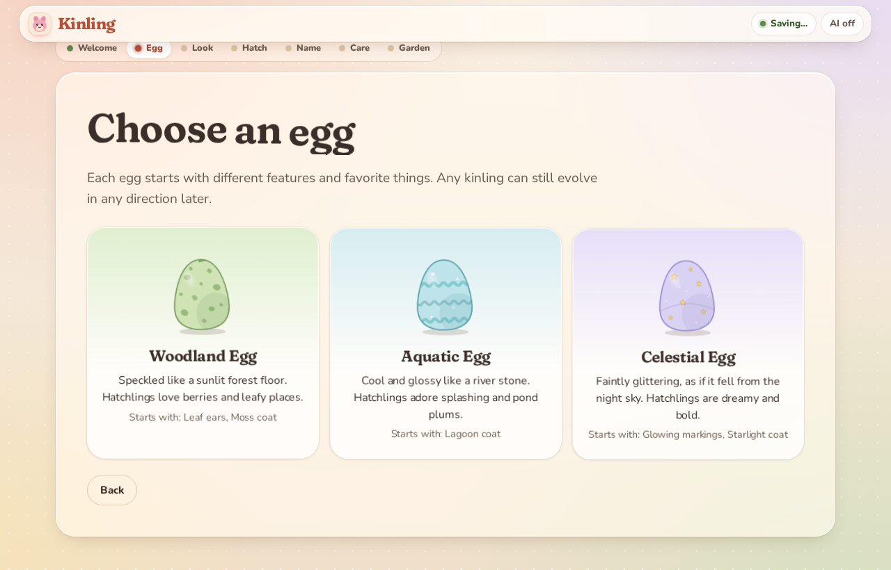
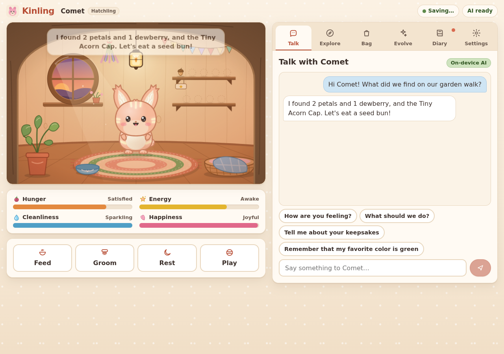
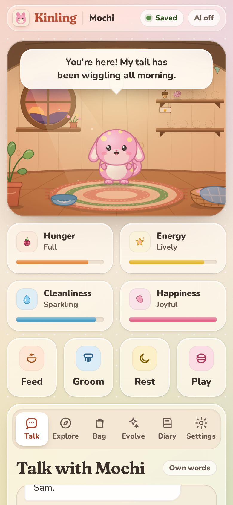

# Kinling

A cozy browser creature-companion game: hatch a kinling, care for it, explore a garden and a pond, collect keepsakes, and shape how it evolves. It can also talk, using a small language model that runs **entirely on your device** through WebGPU.

Built with React, TypeScript and Vite. There's no backend, account, paid API or server-side inference. Saves live in your browser (IndexedDB), and the AI model is downloaded once and cached by the browser.

| Home | Exploring | Evolution |
| --- | --- | --- |
|  |  |  |
| **Choosing an egg** | **On-device AI chat** | **Mobile** |
|  |  |  |

---

## Quick start

Requires **Node 20.19+ or 22.12+** (Vite 8).

```bash
npm install
npm run dev          # http://localhost:5173 (development server)

npm run build        # typecheck (tsc -b) + production build into dist/
npm run preview      # serve dist/ at http://localhost:4173 (service worker active here)

npm test             # unit tests (Vitest)
npm run typecheck    # TypeScript only
```

Browser verification scripts (Playwright; run `npx playwright install chromium` once):

```bash
npm run build && npx vite preview --port 4173 &
npm run e2e                          # full game loop without AI, plus axe accessibility scans
DISPLAY=:99 node scripts/e2e-ai.mjs  # local inference on a WebGPU-capable GPU (see "Verification")
```

Local AI needs a secure context (`https://` or `localhost`) and a WebGPU-capable browser: recent Chrome or Edge, or Safari 26+. The game itself works in any modern browser.

Deploying is just static hosting of `dist/`. The build uses relative paths, so it also works from a sub-folder.

---

## How to play

### First session (about 3 minutes)
1. **Welcome:** choose to download the recommended model (Qwen3 1.7B, ~1 GB), the smaller one (Qwen3 0.6B, ~350 MB), or play without AI. The page explains the download. Onboarding continues while the model downloads, with a progress bar and a cancel button at the top.
2. **Choose an egg:** Woodland, Aquatic or Celestial. Each gives different starting features, personality, affinities and favorite things. Any kinling can still evolve in any direction later.
3. **Customize** colors, markings, ears, tail and build with a live preview. You can also *describe* the look in words ("pink with a cream belly, yellow spots and floppy ears"). The AI, or a built-in word matcher when AI is off, maps the description to supported options. Anything not available at hatching is listed as "can evolve later".
4. **Hatch** (an egg wobble, crack and reveal), then **name** your kinling and, if you like, tell it your name.
5. **First care:** feed it or play with it.
6. **Garden walk:** a short version of the collection minigame that always ends with your first keepsake, the *Tiny Acorn Cap*.

### The 5–10 minute loop
- **Check in.** Four labelled meters show Hunger, Energy, Cleanliness and Happiness. Higher is always better. Your kinling greets you, warmly and without guilt, when you return.
- **Care** with Feed (choose a snack), Groom, Rest and Play. These act instantly, and AI is never needed for them. Repeating the same action within 20 minutes has a smaller (but still positive) effect.
- **Explore** (about 45 seconds per trip; *relaxed mode* gives slower obstacles and +15 s):
  - **Garden Path:** collect leaves, petals, pebbles, dewberries and clover. Bees startle you (you drop your last item, which lands elsewhere on the field) and thorny brambles slow you down.
  - **Pond Shallows:** hop across lily pads. Deep water blocks the way and hopping frogs splash you. Shells, reeds, dewdrops, pond plums and cress.
  - **Deep Reeds:** needs a **paddle tail**. Swim open water with a current, past drifting logs and reed clumps. Richer finds, including the River Pearl.
  - Move with arrow keys / WASD, the on-screen d-pad, or by tapping where to go (the path routes around water and obstacles). Space pauses.
  - A golden treasure may appear; grab it before it fades to find that route's next keepsake. Your first trip to each route guarantees one.
  - Score tiers (bronze/silver/gold) add bonus materials. Gold can also award the rare *Starlit Feather*.
- **Collect** materials, snacks and keepsakes in the **Bag**. Keepsakes also appear on the shelf at home. The Bag's *About* card shows personality, affinities, growth and discovered favorites.
- **Evolve:** compare *Now* and *Preview*, choose options in the visual catalog, or type a request such as *"Make it more aquatic, but keep its pink fur and fluffy ears."*
  - Nothing changes until you press **Apply**.
  - Locked features explain what unlocks them, and unaffordable changes list the missing materials.
  - **Revert** returns to the previous look. Materials aren't refunded, but adopted features stay yours to wear again for free.
- **Talk** in a compact chat. Replies stream from the on-device model, or use hand-written lines when AI is off.
  - Ask it to do things ("you should eat a dewberry and take a nap"): suggested actions appear as buttons you confirm.
  - Describe a new look: a "Preview in Evolve" button appears.
  - Say "remember that…" to save a fact about yourself.
- **Diary:** once a few things have happened, write today's entry, based only on recorded events. The diary tab also lists the kinling's **memories** (pin or forget them) and the **things you told it**.

### Growth systems (all deterministic and bounded)
| System | How it changes |
| --- | --- |
| Needs (0–100) | Slow decay while playing (4–6/h). **Absence is forgiving:** at most 10 hours are ever applied, needs never drop below 30–45 from absence, and energy *recovers* while you're away (it naps). Nothing ever dies or resets. |
| Personality: curiosity, confidence, playfulness (0–100) | Small nudges from meaningful activities: new routes → curiosity; good hauls → confidence; play and adventures → playfulness. Each trait moves at most ±6 per day. |
| Affinities: woodland, aquatic (0–100) | Garden trips and woodland snacks raise woodland affinity; pond trips and aquatic snacks raise aquatic affinity. Each trip adds up to +10, based on score. |
| Bond → life stage | Care, adventures, first-time evolutions and diary entries raise bond. Hatchling → Sprout at 60 → Grown at 200. |
| Preferences | Each egg has a hidden favorite food, a disliked food and a favorite place, discovered through play. |

### Evolution catalog
| Feature | Unlock | First-time cost |
| --- | --- | --- |
| Rounded / floppy / fluffy ears, short / curled tail, spots / stripes / none, 8 starter coat colors, balanced / round / petite builds | From the start | free |
| Leaf-shaped ears | Woodland affinity 15 (Woodland egg: from start) | 5 leaves, 3 petals |
| **Paddle tail** (gameplay: unlocks the Deep Reeds route) | Aquatic affinity 20 + 1 pond trip | 5 reeds, 4 shells |
| Small horns | Woodland affinity 30 | 6 pebbles, 4 leaves |
| Back fin | Aquatic affinity 30 | 6 shells, 4 reeds, 3 dewdrops |
| Glowing markings | Find the Moonpetal keepsake (Celestial egg: from start) | 2 stardust, 3 dewdrops |
| Decorative wings | Starlit Feather keepsake + Sprout stage | 6 petals, 3 stardust |
| Moss / Lagoon / Starlight / Sunset coats | Woodland 25 / Aquatic 25 / Moonpetal / 5 adventures | various |
| Tall build | Sprout stage | free |

Wings and a back fin both sit on the back, so they can't be worn together; the game explains this and lets you swap them in one change. Paying is a one-time thing: reverting and re-applying never costs again and never re-grants rewards. A woodland-egg kinling typically unlocks the paddle tail after 2–3 pond trips (covered by a unit test).

---

## Saves and storage

- **Where:** IndexedDB in *this* browser, through Dexie. Nothing is uploaded. Clearing site data, using a private window or switching browsers or devices means the save isn't there. Use **Settings → Export backup** to keep a copy or move it.
- **What is saved** (schema version 2, validated with Zod on every load and import):
  - creature id, name, appearance, personality, needs, preferences, affinities and bond
  - inventory, unlocks and owned traits, appearance history
  - selected memories (≤80), bounded chat (≤40), diary (≤60), recent events
  - player name and player-provided facts (stored separately from memories)
  - timestamps, settings, the claimed-adventure list and the schema version
- **Autosave** runs about 0.6 s after any meaningful change, plus periodically for time passing and on tab hide or close. The top bar shows *Saved / Saving… / Not saved*.
- **Storage errors** (quota, blocked storage, unreadable data) are shown with a retry option. If the main record is unreadable, the previous good copy (a rolling backup record) is loaded and you're told.
- **Multiple tabs:** a Web Lock makes one tab the writer. Other tabs are **read-only** and show "Play here instead" to take over. Every write is also guarded by a revision check, so two tabs can never silently overwrite each other.
- **Export/import:** JSON files with a format tag. Imports are size-limited (2 MB), parsed defensively, migrated from older formats (v1 → v2 is included) and fully validated, including cross-field rules such as "can't wear locked features". You confirm before anything is replaced.
- **Reset:** Settings → Reset game, confirmed by typing your kinling's name. Downloaded model files are kept.
- **Offline:** a service worker caches the game shell after the first visit (production build), so the game opens without a network connection. The large WebLLM runtime chunks are cached on first use rather than for everyone.
- **Persistent storage:** Kinling asks the browser to keep its data (`navigator.storage.persist()`), and Settings shows the result and storage usage.

---

## Local AI

- **Library:** [`@mlc-ai/web-llm`](https://github.com/mlc-ai/web-llm) 0.2.85, running in a **Web Worker** (`src/ai/worker.ts`). Model ids were checked against the installed package's `prebuiltAppConfig`.
- **Models:**
  - `Qwen3-1.7B-q4f16_1-MLC` (default): ~984 MB download, ~2 GB GPU memory.
  - `Qwen3-0.6B-q4f16_1-MLC` (optional smaller): ~352 MB, ~1.4 GB.
  - Only one model is loaded at a time; switching tears down the previous worker.
  - If the GPU lacks the WebGPU `shader-f16` feature, the matching `q4f32_1` build of the same model is used automatically, and Settings says so.
- **Downloads:** weights come from Hugging Face and the model library from GitHub (WebLLM defaults). Files are cached by WebLLM in the browser's Cache Storage. Nothing is downloaded until you choose to, and **player text is never sent anywhere**.
- **Requests:**
  - Thinking mode is disabled (`extra_body.enable_thinking: false`). One request runs at a time.
  - Output limits are modest (48–200 tokens). Replies are cleaned to 1–2 sentences, and a tone filter replaces guilt-tripping or suffering claims with authored lines.
  - Every request carries a compact snapshot: creature state, mood, appearance, inventory, keepsake-relevant memories, player facts, recent events, the activities actually available and the last few chat messages. The model is never relied on to remember anything between requests.
- **Structured proposals:**
  - Appearance and care-instruction translation use WebLLM JSON-schema output (`response_format: json_object` with an enum of catalog ids).
  - The output is then extracted defensively and validated with **Zod**. Unknown ids are dropped, and the result goes through the same game-rule validation as the visual editor (unlocks, compatibility, costs, "keep" constraints).
  - A rule-based parser runs alongside: its "keep" constraints are always honoured, and it is the fallback when AI is unavailable.
- **The model never controls state.** It can't change needs, inventory, rewards, unlocks, personality or appearance. Proposals become buttons or previews the player must confirm, and they are re-validated when performed. Model text is shown as plain text (never HTML) and never executed.
- **Reliability:**
  - WebGPU and adapter detection; download progress and cancel (already-fetched files are kept).
  - Retry, switch to the smaller model, or play without AI.
  - Errors are classified (device lost, out of memory, network, worker crash, inference error).
  - Evicted model files are detected on startup: you're asked before anything is re-downloaded.
  - Every AI feature has an authored or offline fallback, so the whole care, exploration and evolution loop works without AI.

---

## Project structure

```
src/
  game/          Pure, typed game rules (no React): types, catalog, traits & unlocks, needs & absence,
                 care, adventure rewards, evolution planning/apply/revert, onboarding, memories/diary/chat,
                 authored dialogue, offline request parser, care-proposal validation
  minigame/      Deterministic collection minigame engine (seeded RNG, arenas, grid pathfinding)
  persistence/   Zod save schema, migrations, Dexie storage with revision checks + backup, export/import, tab lock
  ai/            WebLLM worker, engine service (single-flight, cancel, errors), prompts, Zod proposal parsing,
                 companion façade with authored fallbacks
  app/           Store (autosave, status, tabs), controller actions, AI wiring, UI state, sound, motion preference
  render/        Procedural layered-SVG art: Creature (traits + animations), Egg, Habitat, ItemIcon, ArenaArt
  ui/            React interface: onboarding, home stage, needs, care, tabs (Talk/Explore/Bag/Evolve/Diary/Settings),
                 minigame view, accessible primitives, motion helpers (kinetic headings, scroll reveals)
  styles/        Design tokens (tokens.css), self-hosted fonts (fonts.css) and component styles
                 (app.css, creature.css, scenes.css)
  sw/            Service-worker template (precache list generated at build time by vite.config.ts)
  dev/           Art preview harnesses (preview-creature.html, preview-scenes.html; not in the production build)
tests/           Vitest unit tests
scripts/         Playwright end-to-end verification (e2e.mjs, e2e-ai.mjs)
```

All artwork is procedural SVG drawn in code. There are no image files apart from the small app icon, and sounds are synthesized with WebAudio.

The interface uses one small design system: a warm ambient backdrop, translucent glass surfaces (backdrop blur) with lighter tiles layered inside, a fluid type scale with Fraunces for display text and Nunito for UI text, and shared spacing, radius, shadow and easing tokens in `src/styles/tokens.css`. Both fonts (SIL OFL) are bundled from `@fontsource-variable` packages, latin subsets only, so nothing is fetched from a font CDN and they work offline.

---

## Accessibility

- Every control is a real button or input with a label. Tabs follow the WAI-ARIA pattern with arrow-key navigation, and dialogs trap focus and close with Escape.
- Need meters use `role="meter"` with readable values. Chat, speech and toasts are announced through live regions, and the minigame announces pickups and bumps.
- Focus outlines are visible, and colors meet AA contrast (axe: 0 WCAG 2 A/AA violations on all screens tested).
- Reduced motion follows the OS setting by default, or can be forced on or off in Settings. It turns off kinetic headings, scroll reveals, smooth scrolling and ambient loops. Static poses still show state (closed eyes when sleeping, and so on). The minigame has a relaxed mode.
- Entrance animations move and sharpen text but never fade it, so text keeps full contrast on every frame. Kinetic headings expose their plain text to screen readers.
- The sticky header publishes its height so focused or scrolled-to elements are never hidden beneath it. Glass surfaces become opaque with the OS "reduce transparency" or "increase contrast" settings, and selected states keep a visible outline in forced-colors mode.
- The layout is responsive from 360 px phones to desktop. Touch users get a d-pad and tap-to-move.

---

## Verification results

Verified on 2 Oct 2026: Linux (RHEL 9) with an NVIDIA L4 GPU, Node 20.20, Chromium 153 (Playwright's Chrome for Testing).

### Static checks and unit tests
- `npm run typecheck` / `npm run build`: **pass** (TypeScript strict, production build about 0.9 s).
- `npm test`: **69 tests pass** in 6 files:
  - need decay and absence caps
  - care effects and diminishing returns
  - evolution validation (locks, keep constraints, compatibility, costs, clamping, revert without refunds, paddle-tail route gating)
  - adventure rewards (inventory changes, one claim per run, tampered or impossible results, keepsake uniqueness, early-exit rules, reaching the paddle tail through normal pond play)
  - minigame determinism and collisions
  - save validation, export/import round trip, malformed imports, newer-version refusal, v1 → v2 migration
  - IndexedDB conflict detection and backup recovery (fake-indexeddb)
  - malformed AI proposals (prose around JSON, truncated JSON, unknown ids, wrong types, markup, bogus actions)
  - reply cleaning, tone filter, prompt bounds, AI error classification

### Browser: full game loop without AI (`scripts/e2e.mjs`, headless Chromium, production build): **25/25 steps pass**
- **Onboarding:**
  - no-WebGPU explanation
  - egg choice
  - natural-language description via the offline parser (paddle tail correctly deferred to evolution)
  - hatch animation, naming, first feeding
  - garden tutorial awarding the Tiny Acorn Cap
- **Home and chat:**
  - habitat with 4 labelled meters
  - immediate care effects
  - authored chat replies, a "remember that…" fact, care-instruction buttons, chat → Evolve hand-off that previews without applying
- **Exploration and evolution:**
  - pond minigame played by tap-to-move: gold haul, keepsake, inventory changed
  - Deep Reeds locked with an explanation
  - natural-language evolution request listing unavailable features
  - visual editor apply → revert (no refund, feature stays owned)
- **Diary, persistence and saves:**
  - diary entry grounded in events
  - keyboard tab navigation with visible focus
  - reload restores name, diary and keepsakes
  - JSON export; malformed import rejected; modified backup imported, paddle tail adopted, Deep Reeds played
- **Tabs, offline, reset, mobile:**
  - second tab read-only, then "Play here instead" takeover
  - offline reload served by the service worker
  - reset guarded by typing the name
  - reduced-motion preference honoured; mobile viewport has no horizontal overflow
- **0 console errors.** axe-core (WCAG 2 A/AA) found **0 violations** on welcome, customize, home, talk, evolve, diary and settings.

### Browser: real local inference (`scripts/e2e-ai.mjs`, headed Chromium on Xvfb, NVIDIA L4 through Vulkan/WebGPU): **15/15 steps pass**
- **Download and load:** the explicit download choice starts it and onboarding continues during it; download plus first load took about 28–30 s, and a reload from the browser cache took about 15 s with no re-download.
- **Creation description:** "soft pink one with stripes, a cream belly and floppy ears" → *Applied: Peach coat, Stripes, Glowing markings, Floppy ears, Cream belly* (the model picked peach for "soft pink"; code validated every id).
- **Care:** grooming showed an authored line instantly, then a short AI line.
- **Streamed chat,** grounded in recorded events: *"I found 2 petals and 1 dewberry, and the Tiny Acorn Cap. Let's eat a seed bun!"* (14–23 streamed updates, ~4–8 s).
- **Cancellation:** Stop kept the partial reply.
- **JSON proposals:**
  - care instruction → *"A dewberry and a nap sound perfect!"* → [Feed Dewberry | Rest] buttons
  - appearance request → locked paddle tail and back fin, explained by code
  - Evolve request → fluffy ears ready to adopt, "Already has: Stripes", keeping fur color
- **Diary:** *"Dear diary, I'm Comet, and today I hatched from a celestial egg. Sam named me Comet, and I ate a dewberry. I explored the Garden Path, found a tiny acorn cap, and kept it as a keepsake."*
- **Model switch:** switching to Qwen3 0.6B replaced the worker (one model at a time) and chatted successfully.
- **No silent fallbacks:** the run fails if any request falls back while the model is loaded, and none did.

### Bugs found and fixed during verification
- **WebLLM 0.2.85 interrupt quirk:** after a cancelled reply, non-streaming requests return `""` because a leftover interrupt flag is only cleared by streaming requests. All requests, JSON included, now stream.
- **Model "keep" lists:** small models sometimes "keep" the very part the player asked to change. Model keep constraints are now ignored for parts the player explicitly named.
- **Tap-to-move:** could stall at lily-pad gaps and when a current pushed into reeds. Fixed with grid pathfinding over verified links, separate drift, and waypoint avoidance (a greedy test bot now gathers 25+ items on every one of 60 seeds per route).
- **Smaller fixes:** reward inflation (costs rebalanced), contrast issues found by axe, layout overflow, word-order parsing ("make your tail curly").

### Limitations and things not verified
- **The exact `q4f16_1` builds were not run here.** Chromium's WebGPU on this NVIDIA/Vulkan Linux setup does not expose `shader-f16`, so the game automatically used the same Qwen3 models in `q4f32_1` form (an identical code path apart from the model id). On a GPU and browser with `shader-f16` (most recent Windows, macOS and ChromeOS setups), the `q4f16_1` ids listed above are used.
- **Not induced in a browser:** GPU device loss and out-of-memory. Their handling (classification, teardown, retry or smaller-model prompts) is unit-tested and code-reviewed.
- **Browsers:** only Chromium was tested. Firefox and Safari were not. Mobile was checked with Chromium's mobile emulation (390×844, touch), not on physical phones.
- **Model quality:** small models are imperfect. The 1.7B model sometimes reuses the example reply wording or mentions items loosely. Code validation keeps every *state* change correct regardless; only the wording can be off.
